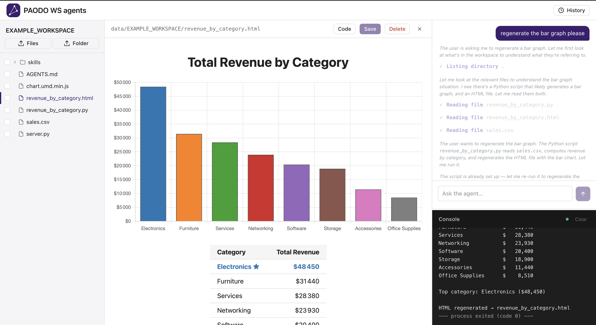
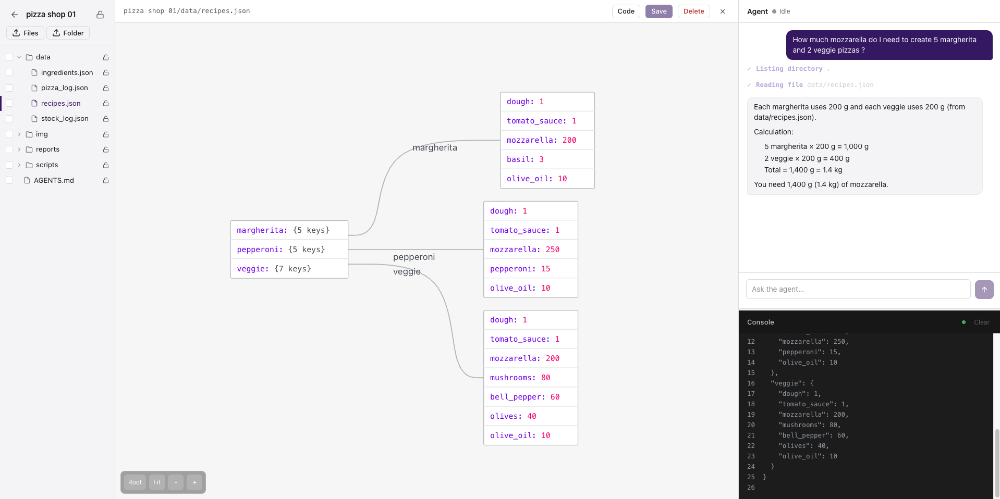
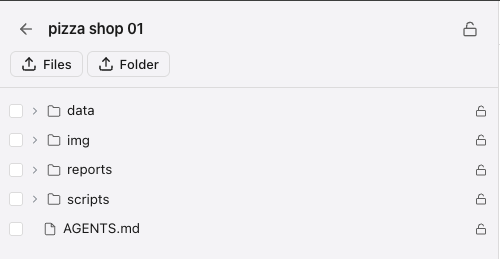
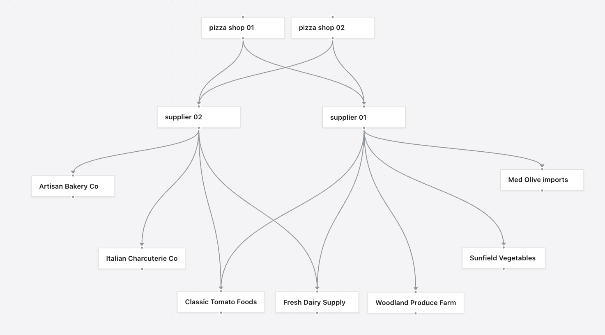

# PAODO Workspace - Self-Hosted AI Workspace Agents

A self-hosted platform for running small, grounded AI-managed services. Each **workspace** is an isolated Docker container with its own agent: write a service, drop in instructions, let the agent operate it. Agents can read and write files, run shell commands, fetch URLs, manage task lists. think VS Code and Claude Code in an isolated workspace as a service.



## What it does

- **Workspaces**: isolated Docker containers with a bind-mounted directory, each with its own agent and `AGENTS.md` instruction file
- **ReAct agent loop**: streams tool calls and responses in real time over SSE; final tokens stream word by word
- **Full tool set**: file read/edit/write, shell execution, glob search, directory listing, web fetch, todo list
- **Lock mechanism**: per-file and per-directory R/RW toggle protects workspace files from accidental agent edits without blocking scripts
- **File browser**: view, edit, upload, and download files from the UI with syntax highlighting
- **API access**: every workspace exposes an HTTP endpoint with an optional per-workspace API key
- **Live console**: shell output and file-change notifications stream over WebSocket in real time
- **Agent-to-agent calls** (Opt-in optional functionality): connect workspaces in a directed graph; agents delegate tasks to each other


## Quick start

**Requirements:** Node.js 20+, Docker (running), an OpenAI API key

```bash
# 1. Install dependencies
npm install

# 2. Configure
cp .env.example .env
# Set OPENAI_API_KEY or ANTHROPIC_API_KEY in .env


# 3. Start
npm run dev
```

Open [http://localhost:3000](http://localhost:3000). The Docker image used to run workspaces is built automatically on first run.

## How it works

**Entry point**: `server.ts` boots a plain Node.js HTTP server that mounts Next.js alongside a WebSocket server on the same port. This lets shell output and file-change notifications stream over `/ws` in real time without a separate process.

**Request flow**

```
Browser / API client
  ├── Chat UI (stateful) ──┐
  └── External API ─────── ┘  HTTP (REST + SSE)
       (stateless)
            │
            │                         WebSocket (/ws?workspaceId=<id>)
            ▼                                    ▲
  Next.js API routes (app/api/)            wsHub broadcasts
            │                          shell output + file events
            ▼
     agentStream.ts
    (SSE → Response)
            │
            ▼
  lib/agent/runner.ts
    AsyncGenerator → AgentEvent
            │
  ReAct loop: think → pick tool → observe → repeat
            │
  ┌─────────────────┬───────────────────────────────────┐
  │  File tools     │  execute_command                  │
  │  (read/edit/    │  → Docker container               │
  │   write/glob)   │    ws_<workspaceId>               │
  │                 │    (lazy spawn, auto-idle)        │
  └────────┬────────┴──────────────┬────────────────────┘
           │                       │
           └───────────┬───────────┘
                       ▼
              data/<workspace>/
              (bind-mounted dir)
```

**Agent loop**: each turn the model receives a system prompt (built from the standard system prompt and workspace's `AGENTS.md`), the conversation history, and tool results, then emits either a tool call or a final answer. Tool calls are executed, their output appended to history, and the loop continues until the model stops calling tools. Events (`tool_start`, `tool_result`, `token`, `done`) are streamed over SSE so the UI updates word by word.

**Sandboxing**: `execute_command` runs inside a per-workspace Docker container (`ws_<id>`) with the workspace directory bind-mounted to `/workspace`. Containers are created lazily, restarted automatically, and stopped after idle timeout. A global lock switches execution to a restricted user (`agent`, UID 999) that can read and run but not write.

**Persistence** is intentionally lightweight: workspace metadata and the agent network graph live in JSON files under `data/`; conversation history is in-memory only and resets on restart or tab close.

## Workspaces

A workspace is a self-contained project environment stored under `./data/<workspace-name>`. It contains the project files the agent can read and edit, workspace-specific metadata (`AGENTS.md`, settings, conversation history), API keys, and runtime state.

Workspaces are isolated from one another: file edits and shell commands are confined to that workspace directory. A common workflow is to create one workspace per repository or feature branch, then add project-specific instructions or secrets as needed.



## File locks

Every file and directory in a workspace can be marked **read-only** or **read-write** from the file tree panel. Click the lock icon next to any item to toggle it; the master lock button at the top locks or unlocks the entire workspace at once. Lock state persists across server restarts.

Locked scripts can still be executed, locked files can still be updated by scripts.

> **Caveat:** per-file locks only block the agent's file tools. A script the agent writes and runs via the shell can still overwrite a locked file. The master lock is the only fully airtight protection. See [doc/agent-lock-bypass.md](doc/agent-lock-bypass.md).



## Agent network *(experimental, opt-in)*

The network page lets you draw directed edges between workspaces. An edge from workspace A to workspace B means A's agent can call B's agent using the `call_agent` tool. Calls are isolated: the callee runs with a fresh conversation history. Cycles are prevented in the UI.

> **Note:** This feature is experimental and disabled by default. Agent-to-agent coordination adds complexity and may not suit every deployment. Enable it by setting `GRAPH_ENABLED=true` in your `.env`.



## API access

Each workspace can be called over HTTP. Enable API access from the workspace panel to generate a key.

```bash
curl -X POST http://localhost:3000/api/workspaces/<id>/agent \
  -H "Authorization: Bearer <api-key>" \
  -H "Content-Type: application/json" \
  -d '{"message": "list all files and summarize what this workspace does"}'
```

The response streams `AgentEvent` objects as newline-delimited JSON:
```
{"type":"tool_start","name":"list_directory"}
{"type":"tool_result","name":"list_directory","result":"..."}
{"type":"token","content":"This workspace contains..."}
{"type":"done"}
```

## Project structure

```
server.ts                    Custom entry: mounts Next.js + WebSocket server on one port
Dockerfile                   Platform image
Dockerfile.workspace         Per-workspace sandbox image (built automatically on first run)
app/api/workspaces/[id]/     REST + SSE endpoints: agent, chat, files, permissions, api-key
app/api/workspace-graph/     Agent network topology API
lib/agent/
  runner.ts                  ReAct loop: AsyncGenerator that streams AgentEvent objects
  systemPrompt.ts            Injects workspace AGENTS.md into every prompt
  tools/                     One file per tool (read, write, edit, exec, glob, fetch, call_agent…)
lib/infra/                   Persistence + runtime services (workspace store, container manager, WS hub…)
components/                  UI panels: chat, file tree, file viewer, live console, graph editor
data/                        Runtime state: gitignored (workspaces, keys, graph)
dev_tools/                   Codebase graph builder (npm run query-graph)
doc/                         Architecture docs, PRDs, ADRs
```

## Known limitations


- **No context compaction**: conversation history grows unbounded per session; there is no manual compact or auto-compact to summarize and trim old messages, so long sessions will eventually hit the model's context limit.

- **Conversation history not persisted**: resets on server restart. Task lists (`todo_write`) are also in-memory only. Workspace files (scripts, data, `AGENTS.md`) are the intended long-term memory.

- **Conversation history differs by entry point**:

  - **Browser chat** (`/chat`): stateful, history accumulates across turns for the duration of the tab session, resets on refresh or server restart
  - **External API** (`/agent`): stateless, every request starts with a fresh context: multi-turn conversations require the caller to pass history themselves
  - **Agent-to-agent calls** (`call_agent`): stateless, each call starts fresh regardless of the caller's own history

- **Concurrent agent sessions work**: multiple agents can target the same workspace simultaneously with isolated memory and a shared console stream; however there is no file locking or queue, so simultaneous writes to the same file are unprotected and could silently overwrite each other under high load.

- **Per-file locks do not prevent shell-level writes**: locking a file blocks the agent's `file_edit` and `file_write` tools, but the agent can write a script to an unlocked path and run it via `execute_command`, bypassing lock checks entirely. The global lock is the only currently airtight enforcement. See [doc/agent-lock-bypass.md](doc/agent-lock-bypass.md).

- **No image reading**: the agent has no tool to read or interpret image files; it can manipulate them as raw files but cannot see their content.

- **Single instance only**: the rate limiter, WebSocket registry, and workspace registry use in-memory state. Running multiple server processes without a shared store will cause inconsistent behavior.

- **Single model for all agents**: the model is set globally via the `OPENAI_model` env var; individual workspaces cannot use a different model.

## Roadmap

- Context compaction
- Budget monitoring
- Monitoring dashboard
- Token count monitoring
- Scheduled agent triggers
- Trusted scripts vs untrusted scripts
- Workspace secrets
- Workspace git versioning
- Streaming reasoning display
- Database storage
- Agent database tools

## ADRs & PRDs

- PRD (Product Requirement Document): describes what to build and why. Keep PRDs in `doc/prd/` (use `doc/prd/draft/`, `doc/prd/accepted/`, `doc/prd/archived/`). Typical sections: `Problem`, `Goals`, `Requirements`, `User stories`, `Open questions`.
- ADR (Architecture Decision Record): records a significant technical decision and its trade-offs. Keep ADRs in `doc/adr/`. Typical sections: `Context`, `Decision`, `Consequences`, `Alternatives`.
- Use PRDs for product/spec discussions and ADRs to capture the final architecture choices so the team remembers why we did things.

## Dev tools

```bash
npm run query-graph -- summary          # codebase overview
npm run query-graph -- file <relpath>   # imports/exports for one file
npm run graph                           # open visual dependency graph in browser
```

## Get in touch

I'm not a professional developer, this is a personal project I built to learn and experiment. If you have questions, spot a security issue, want to suggest an improvement, or just feel like sharing feedback, feel free to reach out. Any advice around security, architecture, or development practices is genuinely welcome.

Discord: **alex_24589**
