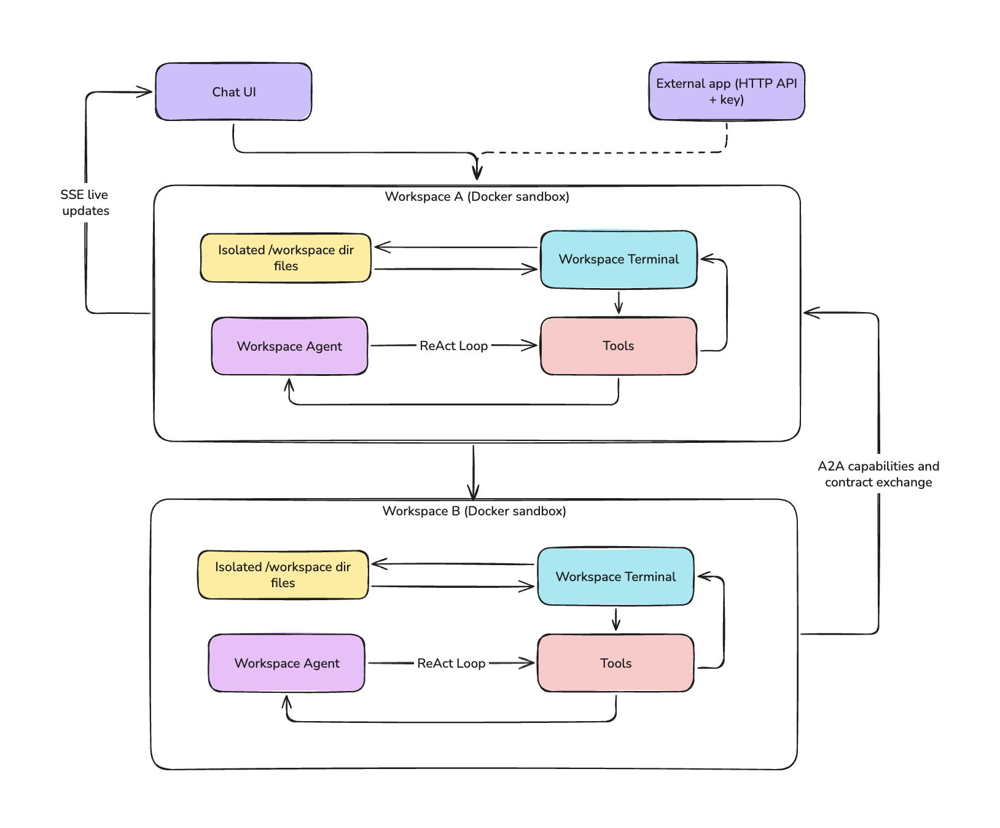

# PAODO Workspaces

**PAODO turns coding agents into controlled, callable AI services.**

Each _workspace_ is an isolated Docker container running its own ReAct loop coding agent. Make it write scripts to run and instructions to follow, then call it through the workspace chat interface or an external API / MCP. Workspaces can be wired into a graph, so agents discover each other and delegate tasks. Think of it as multiple instances of VS Code + Claude Code, each in its own sandbox environment that can be wired together for collaboration.

_Demo video of PAODO in action_ :

[](https://www.youtube.com/watch?v=fxoLx7u8wSE)

## Features

- **Isolated workspaces** — one Docker container per workspace, with its own agent and `AGENTS.md` instructions, running as a restricted non-root user

- **ReAct agent** — full tool set (file read/edit/write, shell, glob, directory listing, `apt_install`, web fetch, todo list, context compaction); streams progress live and is interruptible (press escape to kill the running command)

- **File browser** — view, edit, upload, and download files from the UI, with syntax highlighting

- **HTTP API** — call any workspace's agent externally with a per-workspace API key

- **Workspace MCP** — expose a workspace's skills as MCP tools through a per-workspace, independently revocable access key

- **Scheduled triggers** — run a workspace agent on a recurring schedule

- **Live console** — shell output and file changes stream to the UI in real time

- **Per-workspace secrets** — give each workspace its own third-party API keys; a credential proxy injects the real values into outbound requests so the keys never reach the agent or its container

- **Agent network** — connect specialist workspaces so one agent can call another through defined, validated skills

- **Shared drives** — connect shared storage to selected workspaces so agents can exchange files and collaborate on the same materials.

- **CLI access** — Access the app directly through console, optimized for coding agents. (still in progress)


## Quick start

**Requirements:** Node.js 20+, [Docker](https://docs.docker.com/get-docker/) (running), and an OpenAI, Anthropic, or DeepSeek API key.

```bash
git clone https://github.com/alxcls/PAODO_WS.git
cd PAODO_WS
npm install
cp .env.example .env          # set the API key for your provider
npm run dev
```

Open [http://localhost:3000](http://localhost:3000). The workspace Docker image is built automatically on first run.

For VPS deployment, see the [deploy guide](deploy/README.md).

## How it works

Each workspace runs in its own Docker sandbox and is accessible via the chat UI, external API,
or MCP server. These are thin triggers over shared PAODO operations rather than separate
implementations of the same action. Agents in connected workspaces and MCP clients can invoke skills
using defined input/output contracts. See [Triggers and operations](doc/trigger-operation-architecture.md).



`server.ts` boots a Node.js HTTP server that mounts Next.js plus a WebSocket server on one port, so shell output and file events stream over `/ws` without a separate process. Requests hit Next.js API routes, which run the ReAct loop in [`lib/agent/runner.ts`](lib/agent/runner.ts) and stream events back over SSE.

Every sandboxed tool call — file ops, glob, shell, package installs — runs inside a per-workspace Docker container (`ws_<id>`) as a restricted non-root user, with only that workspace's directory mounted. Containers start on demand and stop after an idle timeout.

Workspace metadata and network configuration are stored as JSON files under `data/`.

For the full architecture, see [`doc/`](doc/).

The agent runs a ReAct loop with the following tools:

- **Files** — `file_read` · `file_write` · `file_edit` · `list_directory` · `glob`
- **System** — `execute_command` · `stop_task` · `apt_install` · `http_get`
- **Session** — `todo_write` · `compact_context` · `workspace_history` · `workspace_restore`
- **Agent network** — `list_agents` · `call_agent`
- **Shared drives** — `drive_ls` · `drive_read` · `drive_download` · `drive_upload` · `drive_delete`

## Agent network

Workspaces can call each other. The network page connects them into a directed graph; an edge **A → B** lets A's agent invoke B's. Agents find their neighbors with `list_agents` and call them with `call_agent`.

Calls are **contract-first**: each workspace publishes typed _skills_ (`.skills/*.json`), and the platform validates the caller's input and the callee's output against the skill's schema. The callee runs in a fresh, isolated conversation. No graph edge, no call.

## Workspace API access

Enable API access from the workspace panel to generate a key, then:

```bash
curl -X POST http://localhost:<port>/api/workspaces/<id>/agent \
  -H "Authorization: Bearer <api-key>" \
  -d '{"message": "list all files and summarize what this workspace does"}'
```

The response is a Server-Sent Events stream of progress events (`tool_start`, `tool_end`, …), ending in a single `response` event that carries the final answer, then `done`.

Each call starts its own conversation, visible in the workspace UI. To thread calls together
instead, pass the `conversationId` returned in the `X-Conversation-Id` header back in the next
request body.

## Workspace MCP access

Enable MCP access from the workspace panel to mint a bearer secret, then point any MCP client at the
workspace:

```json
{
  "mcpServers": {
    "paodo-<id>": {
      "type": "http",
      "url": "http://localhost:<port>/api/workspaces/<id>/mcp",
      "headers": { "Authorization": "Bearer <mcp-secret>" }
    }
  }
}
```

The client sees the workspace's declared skills and nothing else — no agent tools, no filesystem, no
graph. Each skill's `.skills/*.json` contract becomes the tool's input and output schema, and calls
run through the same validated path the agent network uses. The secret is stored hashed, shown once,
and revoked independently of the API key.

There is no per-skill publication step: whatever the workspace declares in `.skills/` is what the
endpoint serves, read fresh on every request, so a skill the agent adds is callable at once and one
it deletes is neither listed nor callable. Enabling the MCP and handing out its secret is the
authorization decision — give it only to clients you would trust with every skill the workspace
declares. The workspace panel lists the currently exposed tools so you can see the surface change.

Skill calls are one-shot, unlike the chat API above: each runs in a fresh, isolated conversation, so
there is no `conversationId` to continue — a caller that needs different arguments calls again
rather than resumes. Those conversations are still persisted and visible in the workspace UI and dashboard for
auditing.

## Known limitations

- **No automatic compaction** — the agent compacts context on demand via `compact_context`, but never automatically by size.

- **No file write queue** — concurrent writes to the same file can overwrite each other under load.

- **No image reading** — the agent handles images as raw files but can't see their content.

## Roadmap

Automatic (size-triggered) compaction · budget monitoring · database storage and tools.

## Contributing

This is a personal project to build a power tool for small AI agent services. Help or opinion about the project is genuinely welcome.

Discord: **alex_24589**

## License

MIT — see [LICENSE](LICENSE).
